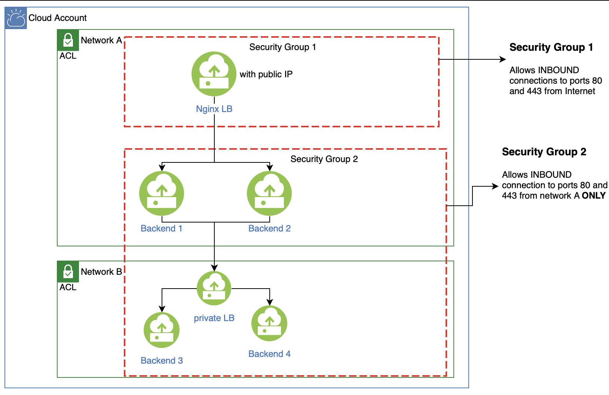

# Dynamic Nginx Proxy

Managing Load Balancers can be hard. I have been looking for a tool that makes it possible to dynamically manage my nginx configs dynamically for my backend servers. 

Usually on cloud you would have a LB that takes all the hassle from you. However, in my case I did not have the option to use the Cloud Provider LB, as it did not exist. Hence, I had to install Nginx LB as the main gateway to all of my backend servers. Here is how my setup look like:



At LB and proxying at the backend level, I found [traefik proxy](https://traefik.io/traefik/) and [jwilder nginx-proxy](https://github.com/nginx-proxy/nginx-proxy) very useful and they do automate the process for proxying requests between and to docker containers.


## How it started?
I used to setup nginx manually by sshing into the LB and add or remove hosts. It was not ideal, but it allowed me to keep going. This was not ideal at all due to:

1. The most important one is reverting back. I did not have an option to audit the changes that I made on the LB. In case of rolling back, I had either to remember the change or `cp current.conf ~/current.conf.bk`, yes I know.
2. Making direct changes on LB is bad, a single mistake can take whole webapps down.
3. Manual changes is bad, the process is repeated and it has to be automated. When you see your self repeating the same task 3 times, it is time to automate it.

## So what's the solution?

I wanted to create my own script that generates nginx conf files on the fly and add that to my cicd pipeline. However, I did want to re-invent the wheel, hence, I started looking around and found this tool [confd](https://github.com/kelseyhightower/confd) made by [@kelseyhightower](https://github.com/kelseyhightower). 

It is simple. Create a template and data source, and let `confd` do the rest for you! I won't go deep into how it works, you can read that [here](https://github.com/kelseyhightower/confd/blob/master/docs/quick-start-guide.md). There are three main files you need:

1. template file to render (in `./templates`)
2. template resource config file (in `./confd`): basically tells `confd` 
    1. what keys it should read from a data source file.
    2. what to name the output file.
    3. what template file it should render
    4. what script it should run after redner is done
    5. and some other configs you can find in [configuration-guide](https://github.com/kelseyhightower/confd/blob/master/docs/configuration-guide.md).
3. datasource file in `YAML` to read keys and values from. (it can be `etcd` `vault` or any other supported datasource)


In this repo I used backend type: `file` which means read data from a locally stored file. The nginx template is located in `./templates/nginx.conf.tmpl`. My datasource file is `nginx-datasource.yml`. I can freely setup the file the way I want. The important part is in `conf.d/mynginx.toml` where I select the root keys that will be passed to the template generator engine.
```
// snippet from conf.d/mynginx.toml
...
keys = [
  "/upstream",
  "/proxy_pass",
  "/domain",
  "/domains",
  "/ssl_cert_path",
  "/ssl_key_path",
]
```

Finally and importantly, in the scrip `generate.sh`, I tell `confd` which `ROOT KEY` to pick up from the datasource using the flag `-prefix`. For example, if I want to generate conf only for `backend-1` in the datasource, then I just need to run confd with `-prefix backend-1`.

You can add that into a cicd pipeline that will automatically deploy your changes to both LBs, and this will automate the whole process of configuring your LB + you can easily revert and audit changes.

`confd` is awesome tool to automate and dynamically configure your infra. It can do more than I showed in this article. Go ahead and explore more in the [docs](https://github.com/kelseyhightower/confd/tree/master/docs).


